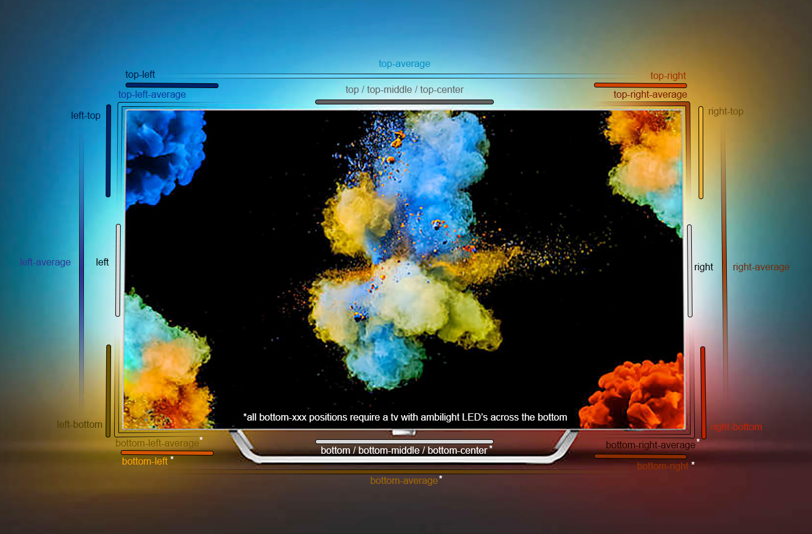

> ### Update:
>
> This repository now contains three different components
> - The Phillips TV Ambilight (Light) Component (phillips_ambilight)
> - The Ambilight+Hue ON/OFF (Switch) Component (phillips_ambihue)
> - The (new) Ambilight+Yeelight Component (see below)


# Philips TV Ambilight (Light) Component for Home Assistant

This custom component utilizes the [JointSpace API](http://jointspace.sourceforge.net/projectdata/documentation/jasonApi/1/doc/API.html) to control the Ambilight on a 2016+ Philips Android TV from within Home Assistant

### For more help with this component, see the [discussion](https://community.home-assistant.io/t/philips-android-tv-ambilights-light-component/67754) on community.home-assistant.io

> ### New in this Version:
> - All components updated for the 'Great Migration' (thanks [hutchinsane](https://github.com/hutchinsane))
> - There is apparently an issue for setting the ambilight brightness on some TV's where the colour is always changed, even when in manual mode, I have implemented a potential workaround for this using a method highlighted by [gyrga](https://community.home-assistant.io/u/gyrga), but it is commented out by default. See Line 130 in ```light.py```

## Installation
First Pair your TV, and generate the username and password using [this tool](https://github.com/suborb/philips_android_tv) and enter the details, along with the IP address of your TV into your configuration.yaml as follows:
```
light:
  - platform: philips_ambilight
    name: Bedroom Ambilight
    host: 192.168.1.XXX
    username: !secret philips_username
    password: !secret philips_password
```

**Place the ```phillips_ambilight``` directory in your 'config/custom_components/' directory, and restart Home Assistant**

## Features
This component has the following features:
- Power Ambilight ON/OFF
- Brightness
- RGB colour
- Effects
  - Manual (custom RGB color for all LED's)
  - Standard (Follow Video)
  - Natural (Follow Video)
  - Football / Immersive (Follow Video)
  - Vivid (Follow Video)
  - Game (Follow Video)
  - Comfort (Follow Video)
  - Relax (Follow Video)
  - Lumina / Adaptive Brightness (Follow Audio)
  - Colora / Adaptive Color (Follow Audio)
  - Retro (Follow Audio)
  - Spectrum (Follow Audio)
  - Scanner (Follow Audio)
  - Rhythm (Follow Audio)
  - Party / Random (Follow Audio)
  
Individual effects can be easily removed from the Front-End by removing them from the ```AMBILIGHT_EFFECT_LIST``` (line 53 of 'light.py' in the 'phlips_ambilight' folder.)

## Known Issues
- The light component can turn the Ambilight on when the TV is off, however, after the TV has been in standby for a long period of time, the component will lose connection, and will be unable to turn the lights on again until the TV is woken up and reconnects - this can be solved by manually turning on the TV and then changing the ambilight, or through the use of an IR blaster connected to Home Assistant to achieve the same result.

## Older Philips TV's
Older (non-Android) Philips TV's with ambilight, which use the JointSpace API, may be controllable through this component, try changing the `BASE_URL` on line 20 to `http://{0}:1925/1/{1}`. Note: as the older API does not use HTTPS, there is no need for the `username` and  `password` fields to be generated or placed into your `configuration.yaml`, there may also be changes needed to the `_getReq()` and `_postReq()` sections to accommodate this, If anyone is successful with this, let me know and I will update this section.

# Phillips TV Ambilight+Hue (Switch) Component
For automating the control of the Ambilight+hue setting, use the additional Ambihue (Switch) component, this enables the status of the setting to be determined by Home Assistant, and allows for remote or automated toggling.
## Installation
If you have already set up the Ambilight component, installing this switch component is very simple, copy the ```phillips_ambihue```  directory into your ```config/custom_components/``` directory,
enter the same username and password as for the ambilight component in the configuration.yaml as follows:
```
switch:
  - platform: philips_ambihue
    name: Ambilight+hue
    host: 192.168.1.XXX
    username: !secret philips_username
    password: !secret philips_password
    scan_interval: 5
```
*note* there is often a noticeable lag between Home Assistant sending the request to toggle the setting, and receiving a status update from the API, for this reason, it is advised that you reduce your `scan_interval` (in seconds) to suit your needs.

# Phillips TV Ambilight+Yeelight (Switch) Component 
## ``` Work in Progress```


>### Epilepsy Warning:
>At times when testing this component (usually when the TV is displaying an ambient light / no colour), the bulb is still updated rapidly and can cause a noticeable flicker - if you have **Epilepsy** this may not be for you. (Yet)

> ***Bug Bounty:*** If anyone can find a solution to this, while there will be no financial reward, you will have my eternal gratitude :) (see Lines 83, 314, 316 etc).

This new (and pretty unrefined) component mimics surprisingly well the funtionality of Amilight+Hue with all Yeelight bulbs/lights using the Music Mode function from their API. The colour of the bulb is read constantly from the TV (jointspace), processed on the Home Assistant machine, and updates are pushed to the bulb in a loop until turned off. I'm sure it could be improved, so the code is commented, I encourage you to have a play with the values and check the links for more custom changes, if something else works better, or adds more features ill be happy to add them in for everyone. The values I've chosen are simply through trial and error. 

## Installation
If you have already set up the Ambilight component, installing this component is very simple, copy the ```philips_ambilight+yeelight``` directory into your ```config/custom_components/``` directory,
enter the same username and password as for the ambilight component in the configuration.yaml, along with both the IP of the TV, and the IP of the bulb as follows, and restart home assistant:
```
switch:
  - platform: philips_ambilight+yeelight
    name: Lounge Lamp (Top Right) # (Name in Front-End)
    host: 192.168.1.XXX # (the TV)
    username: !secret philips_username
    password: !secret philips_password
    address: 192.168.1.XXX # (The Bulb)
    display_options: right-top
```


The per-bulb positions I have added (defined by ```display_options```) are as follows:



> Note: 
> - I have not tested each and every one of these positions manually, if one of them doesn't seem right, assume it's my fault and let me know :)
> - As I do not have a TV with bottom ambilight LED's, I have not been able to test this part at all, although it should work in theory, please let me know if you have any success.

For a more custom position, different value calculations, or perhaps something different entirely, see the links in the code's comments. Understanding the 'topology' section [(JointSpace API)](http://jointspace.sourceforge.net/projectdata/documentation/jasonApi/1/doc/API.html) will go a long way to explaining how this part works.

## Resources

This component works by combining (or using features from) the following resources with a custom python script, if you would like to understand or improve different parts of this component, this is a good place to start:
- [Python-Yeelight Library](https://yeelight.readthedocs.io/en/latest/) (Included in Home Assistant) by [Stavros](https://gitlab.com/stavros)
- [Pylips](https://github.com/eslavnov/pylips) - Phillips TV / Jointspace library (not Included) by [eslavnov](https://github.com/eslavnov) (very useful for testing)
- The Phillips [JointSpace API  Documentation](http://jointspace.sourceforge.net/projectdata/documentation/jasonApi/1/doc/API.html)
- [Philps Jointspace v6 Commands](https://gist.github.com/marcelrv/ee9a7cf97c227d069e4ee88d26691019) by [marcelrv](https://gist.github.com/marcelrv)
